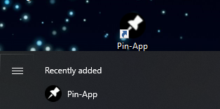

# Pin-App
Pin-App is a Java app that allows users to select windows that they have open to be pinned in front of their other windows. When a window is pinned it will not be overlapped by any other open windows unless the other window is also pinned.

**\~\~ See [releases](https://github.com/bobcat33/PinApp/releases) for the executable Windows installer \~\~**

### Table of Contents
* [Installation](#install)
* [Usage](#usage)
* [Things to note](#toNote)

# Installation
* To install the app first download the dedicated installer from the latest release in [releases](https://github.com/bobcat33/PinApp/releases), then run it.

* Follow the steps in the installer, then once it's installed the app will create a shortcut on your desktop as well as appear in your Windows app drawer.

* Run the app to make it appear in your system tray.

* Follow [this quick guide](https://support.microsoft.com/en-us/windows/add-an-app-to-run-automatically-at-startup-in-windows-10-150da165-dcd9-7230-517b-cf3c295d89dd) to add the app to your startup apps so that it opens every time you turn your computer on.

# Usage
* To pin an app simply right click on the app in the system tray.

* And select the desired app from the list.

* Once selected the app window will be pinned above your other windows, to unpin it simply select it again or select "Unpin all pinned windows". The pinned windows are highlighted with a tick mark before their name.

# Things to note
* **This will only work on Windows operating systems.** I have only tested it on Windows 10 but it is likely to work on previous (and future) versions of Windows too.
* I programmed this app using JDK 16.0.1 and the following libraries:
  - [JNA](https://github.com/java-native-access/jna#jna) (v5.10.0)
  - [JNA Platform](https://github.com/java-native-access/jna#jna-platform) (v5.10.0)
* Some windows are not able to be pinned, I have listed the ones I know of below but if you find any more please let me know in [issues.](https://github.com/bobcat33/PinApp/issues)
  - Task Manager (Can be pinned from within Task Manager in its options dropdown menu by selecting "Always on top")
  - Windows Resource Manager
* Occasionally an app might not be pinned, I am currently unsure why this happens but restarting Pin-App or closing and re-opening the app's window often helps.
* I have not extensively tested this app, if you find any bugs / problems please report them in [issues](https://github.com/bobcat33/PinApp/issues) or [start a discussion.](https://github.com/bobcat33/PinApp/discussions/categories/bugs)
* I am fully open to critisism, if you think there are better ways of doing certain things or you have feature requests feel free to share them in [discussions](https://github.com/bobcat33/PinApp/discussions/categories/ideas) :)

[Back to Top ^](#Pin-App)
