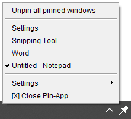

# Pin-App
Pin-App is a Java app that allows users to select windows that they have open to be pinned in front of their other windows. When a window is pinned it will not be overlapped by any other open windows unless the other window is also pinned.

# Usage
* To pin an app simply right click on the app in the system tray.

* And select the desired app from the list.

* Once selected the app window will be pinned above your other windows, to unpin it simply select it again or select "Unpin all pinned windows". The pinned windows are highlighted with a tick mark before their name.

